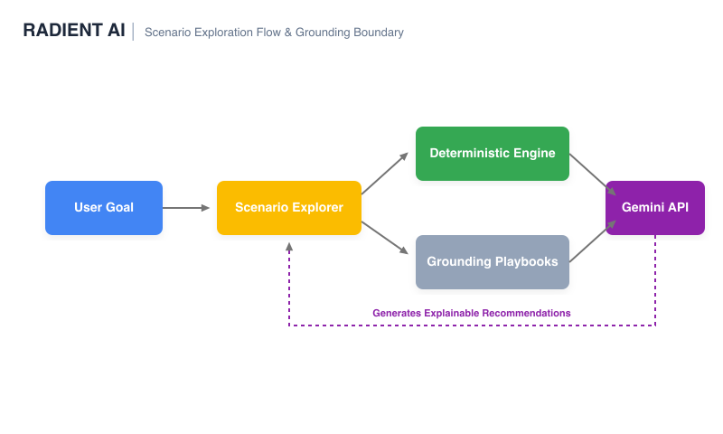
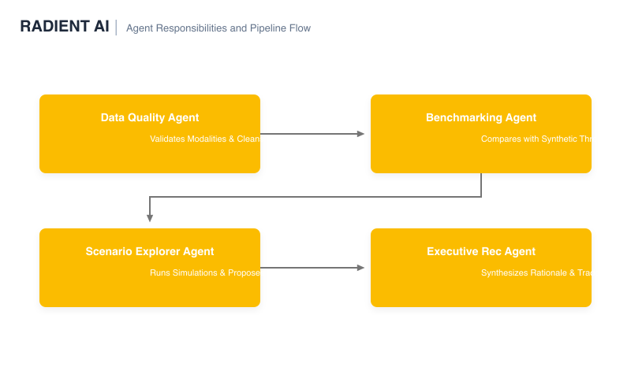
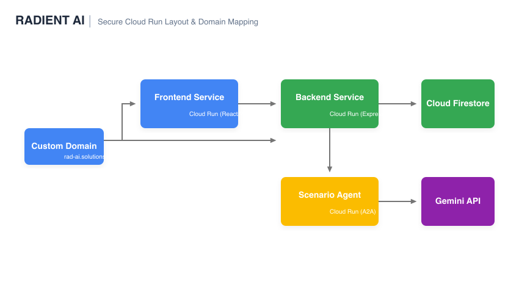
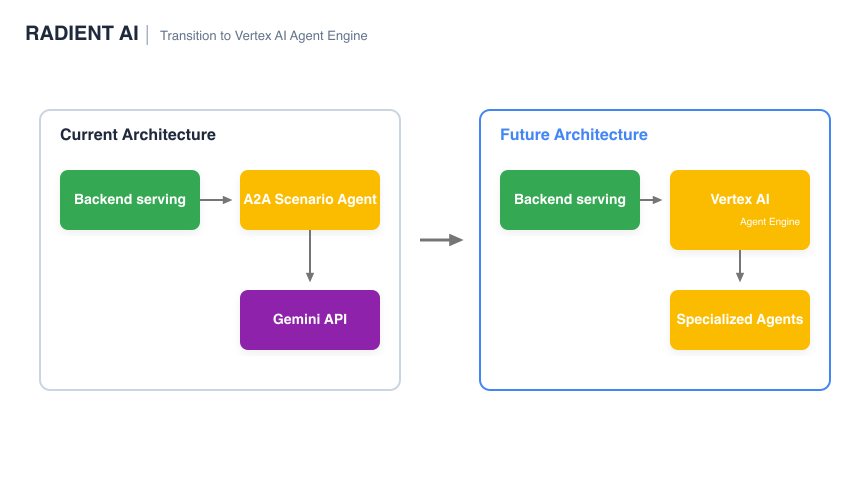

# Radient AI — Intelligent Radiology Operations & Scenario Explorer

> **Live Demo:** [https://rad-ai.solutions](https://rad-ai.solutions)  
> *Note: The prototype operates exclusively on synthetic operational datasets and contains no patient-identifiable information. Certain implementation details are intentionally omitted from this public repository package to protect proprietary intellectual property.*

---

## 📋 Table of Contents
1. [Project Overview](#-project-overview)
2. [The Problem Statement](#-the-problem-statement)
3. [The Solution: Radient AI](#-the-solution-radient-ai)
4. [Why Agentic AI?](#-why-agentic-ai)
5. [Key Features](#-key-features)
6. [Tech Stack](#-tech-stack)
7. [System Architecture & Diagrams](#-system-architecture--diagrams)
8. [UI/UX Screenshots](#-uiux-screenshots)
9. [Future Intelligence Expansion](#-future-intelligence-expansion)
10. [Google Cloud Challenge Alignment](#-google-cloud-challenge-alignment)

---

## 🔍 Project Overview
**Radient AI** is an agentic operational intelligence platform designed to help radiology leaders optimize staffing, reduce technologist burnout, improve scanner utilization, and evaluate operational tradeoffs through explainable AI. By separating deterministic calculation logic from generative explanations, Radient AI delivers mathematical precision backed by Gemini-powered explanation, recommendations, and remote Agent-to-Agent (A2A) orchestration.

---

## ⚠️ The Problem Statement
Modern radiology departments face a multi-variable operational crisis:
* **Technologist Burnout:** Overtime rates exceed sustainable limits, causing staffing shortages and turnover.
* **Underutilized Capital Assets:** Multi-million dollar MRI/CT scanners sit idle due to scheduling gaps or understaffing.
* **Complex Optimization Tradeoffs:** Human schedulers cannot easily balance labor costs, technician shifts, minimum coverage rules, and patient wait times.
* **Unreliable Generative AI:** Relying on LLMs to generate operational numbers results in hallucinations, invalid budget math, and untrustworthy recommendations.

---

## 💡 The Solution: Radient AI
Radient AI introduces an agentic, explanation-focused architecture that bridges the gap between rigid operational spreadsheets and flexible AI advisors:
1. **Deterministic Calculators:** TypeScript-based formulas compute exact FTE counts, overtime costs, burnout risk indexes, and patient throughput. **Gemini does not own the numbers.** Deterministic tools own all calculations, while Gemini specializes in explanation, tradeoff analysis, and executive communication.
2. **Gemini Generative Synthesis:** Google Gemini acts as an expert consultant, interpreting the exact numbers to explain tradeoffs and recommend next actions.
3. **Agent-to-Agent (A2A) Protocols:** The AI Scenario Explorer is hosted as a separate, isolated microservice, communicating via JSON-RPC 2.0 to ensure system modularity and zero side-effects.

---

## 🤖 Why Agentic AI?
Radient AI separates responsibilities across deterministic calculators, Gemini-powered explanation, and remote A2A services. This architecture:
*   **Preserves numerical correctness** by routing all calculations to pure JavaScript tools instead of probabilistic models.
*   **Prevents hallucinated calculations** in reports and dashboards.
*   **Enables modular microservices** that can run, scale, and fail independently.
*   **Supports future managed agent runtimes** by establishing strict input/output boundaries.
*   **Keeps operational intelligence explainable** for administrators and clinical directors.

---

## ✨ Key Features
*   **Interactive Modality Dashboard:** High-fidelity current-state overview showing worked FTEs, paid FTEs, overtime costs, wait times, and scanner utilization.
*   **AI Insights Panel:** Dynamic, current-state summaries highlighting anomalies, low scanner utilization, or elevated technician burnout risk.
*   **AI Scenario Explorer:** A natural-language interface allowing users to input optimization goals (e.g., *"Reduce MRI costs by 1 FTE without increasing wait times past 15 mins"*).
*   **Ranked Scenario Recommendations:** Evaluates dozens of operational settings, ranks the top scenarios, and flags feasibility issues.
*   **Robust Fallback Engine:** Gracefully degrades from remote A2A calls to local wrapper executions, and from file-based RAG grounding to basic models if resources are offline.

---

## 🛠️ Tech Stack

### Frontend
*   **React** (SPA Framework)
*   **TypeScript** (Type safety)
*   **Vite** (Build tool)

### Backend
*   **Node.js** (Runtime environment)
*   **Express** (Serving API framework)
*   **TypeScript** (Application logic)

### AI & Agents
*   **Gemini 2.5 Flash** (Reasoning, explanation, and synthesis)
*   **Lightweight file-based grounding** (Clinical operation playbook context)
*   **A2A SDK** (Agent orchestration framework)
*   **JSON-RPC 2.0** (Inter-agent message protocol)

### Infrastructure & Cloud
*   **Docker** (Containerization)
*   **Google Cloud Run** (Microservice hosting)
*   **Firestore** (Session caching and persistent states)

### Agent Compatibility
*   **Google ADK patterns** (Metadata and lifecycle standards)
*   **Agent Cards** (Self-describing capability definitions)
*   **Future Vertex AI Agent Engine support** (Seamless transition plan)

---

## 🏗️ System Architecture & Diagrams

### 1. High-Level App Architecture
The high-level app flow shows the relationship between users, frontend UI, backend services, A2A Scenario Agent, and Gemini API.

  

### 2. Scenario Explorer Decision Flow
Separates deterministic tools from LLM reasoning. Gemini receives calculated scenarios and grounding materials to prioritize and explain recommendations.

  

### 3. Multi-Agent Pipeline
Shows the information processing pipeline from raw ingestion (Data Quality) to scoring (Benchmarking) to simulation (Explorer) to reporting (Executive Recommendation).

  

### 4. Cloud Run Topology
Layout of microservices deployed on Google Cloud Run utilizing custom domains, Firestore caching, and secure Gemini API bindings.

  

### 5. Future Architecture Migration
Migrating from our current Cloud Run A2A instances to Vertex AI Agent Engine and managed Agent Runtimes.

  

### 6. Deterministic vs Generative Division
Visual mapping of concerns showing why deterministic tools own all numbers while Gemini handles communication.

  

---

## 📸 UI/UX Screenshots
Here are key screenshots illustrating the operational flows:

*   **Interactive Modality Dashboard**: Real-time synthetic metrics, FTE ratios, overtime alerts, and scanner capacity charts.
*   **AI Insights**: Live notification feed highlighting night-shift scanner underutilization.
*   **AI Scenario Explorer**: The query panel where directors enter natural-language goals.
*   **Ranked Recommendations View**: Evaluated scenario cards showing calculated scores, FTE counts, savings, and burnout metrics.
*   **A2A Negotiation Log**: Raw JSON logs verifying A2A handshake, agent-card retrieval, and JSON-RPC transactions.

*(Refer to [docs/screenshots.md](docs/screenshots.md) for detailed layout diagrams and mock visuals).*

---

## 🔮 Future Intelligence Expansion
The current prototype demonstrates the architecture using a small set of synthetic benchmarks and operational guidance. Future development will incorporate expert-informed knowledge from:
*   **Imaging Directors & Radiology Managers** (Workflow constraints)
*   **Staff Technologists** (Burnout thresholds and shift preferences)
*   **Hospital CFOs & Revenue Cycle Leaders** (Budget limits and billing guidelines)
*   **Operational Excellence Experts** (Modality throughput rules)

Long-term, Radient AI aims to build a comprehensive clinical benchmark database and rich operational intelligence frameworks covering multiple specialties.

---

## 🏆 Google Cloud Challenge Alignment
Radient AI aligns closely with Google Cloud's AI and cloud application blueprints:
*   **Gemini-Powered Explanations:** Employs Gemini for advanced operational tradeoffs analysis and RAG-grounded reports.
*   **Independent Cloud Run Services:** Scales and deploys Frontend, Backend, and Agent systems as isolated microservices.
*   **ADK & Agent Engine Readiness:** Conforms to Google's Agent Development Kit patterns, ensuring future compatibility with Vertex AI Agent Engine and managed Agent Runtimes.
