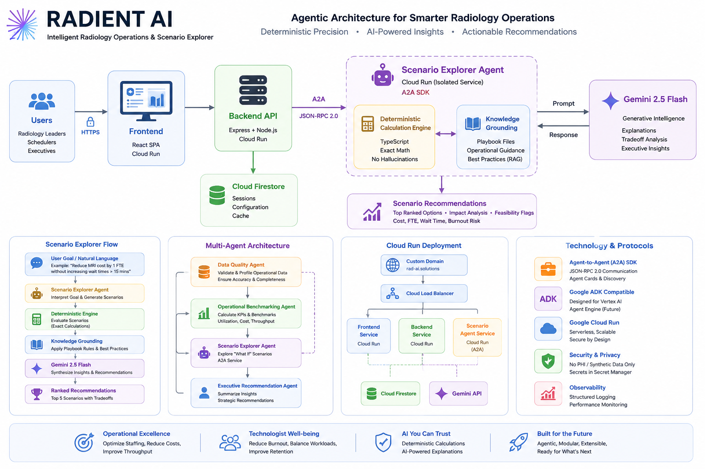
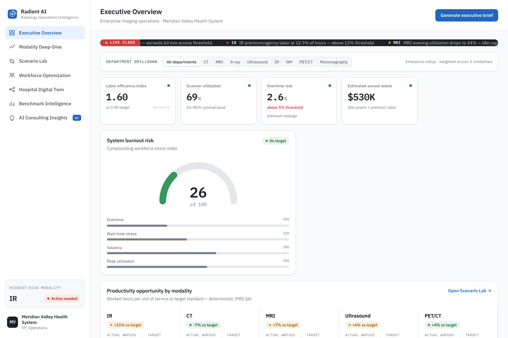
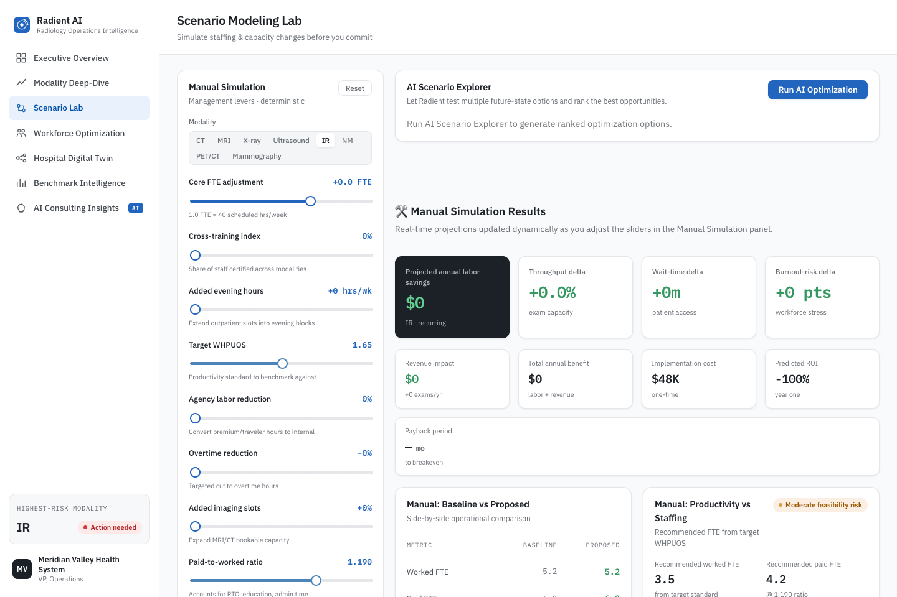
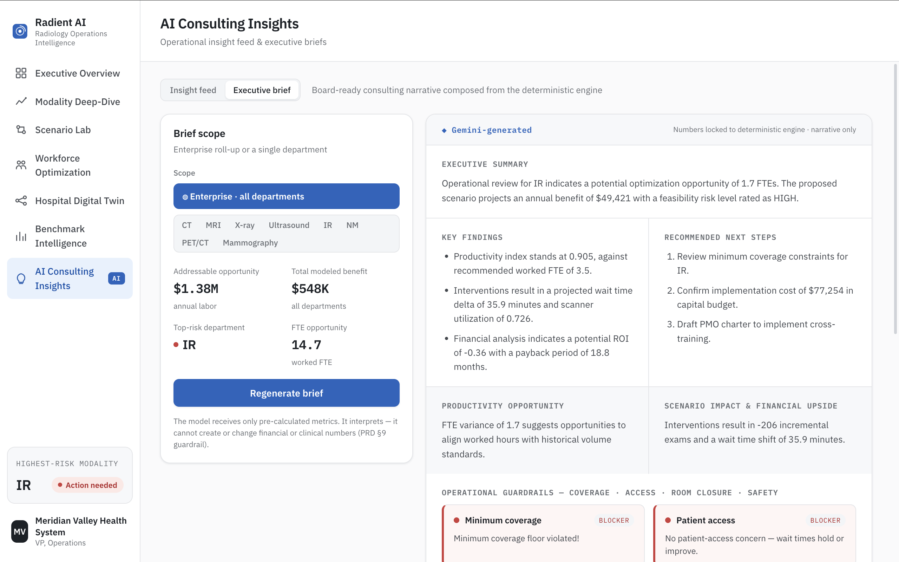
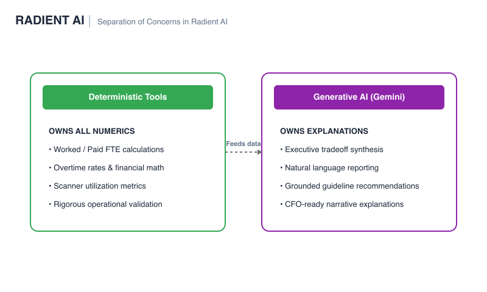

# Radient AI: Intelligent Radiology Operations & Scenario Explorer

> **Live Demo:** [https://rad-ai.solutions](https://rad-ai.solutions)  
> *Note: The prototype operates exclusively on synthetic operational datasets and contains no patient-identifiable information. Certain implementation details are intentionally omitted from this public repository package to protect proprietary intellectual property.*

---

## 📋 Table of Contents
1. [Project Overview](#-project-overview)
2. [The Problem Statement](#-the-problem-statement)
3. [The Solution: Radient AI](#-the-solution-radient-ai)
4. [Why Agentic AI?](#-why-agentic-ai)
5. [Key Features](#-key-features)
6. [Tech Stack](#-tech-stack)
7. [Product Walkthrough](#-product-walkthrough)
8. [Architecture Overview](#-architecture-overview)
9. [Why This Architecture Matters](#-why-this-architecture-matters)
10. [Future Vision](#-future-vision)
11. [Google Cloud Challenge Alignment](#-google-cloud-challenge-alignment)

---

## 🔍 Project Overview
**Radient AI** is an agentic operational intelligence platform designed to help radiology leaders optimize staffing, reduce technologist burnout, improve scanner utilization, and evaluate operational tradeoffs through explainable AI. By separating deterministic calculation logic from generative explanations, Radient AI delivers mathematical precision backed by Gemini-powered explanation, recommendations, and remote Agent-to-Agent (A2A) orchestration.

---

## ⚠️ The Problem Statement
Modern radiology departments face a multi-variable operational crisis:
* **Technologist Burnout:** Overtime rates exceed sustainable limits, causing staffing shortages and turnover.
* **Underutilized Capital Assets:** Multi-million dollar MRI/CT scanners sit idle due to scheduling gaps or understaffing.
* **Complex Optimization Tradeoffs:** Human schedulers cannot easily balance labor costs, technician shifts, minimum coverage rules, and patient wait times.
* **Unreliable Generative AI:** Relying on LLMs to generate operational numbers results in hallucinations, invalid budget math, and untrustworthy recommendations.

---

## 💡 The Solution: Radient AI
Radient AI combines deterministic operational modeling with Gemini-powered explanation to create a trustworthy AI consultant for radiology leaders.
1. **Deterministic Calculators:** TypeScript-based formulas compute exact FTE counts, overtime costs, burnout risk indexes, and patient throughput. **Gemini does not own the numbers.** Deterministic tools own all calculations, while Gemini specializes in explanation, tradeoff analysis, and executive communication.
2. **Gemini Generative Synthesis:** Google Gemini acts as an expert consultant, interpreting the exact numbers to explain tradeoffs and recommend next actions.
3. **Remote Scenario Agent:** The AI Scenario Explorer is hosted as an isolated microservice and communicates through A2A SDK and JSON-RPC 2.0.

---

## 🤖 Why Agentic AI?
Radient AI separates responsibilities across deterministic calculators, Gemini-powered explanation, and remote A2A services. This architecture:
*   **Preserves numerical correctness** by routing all calculations to pure JavaScript tools instead of probabilistic models.
*   **Prevents hallucinated calculations** in reports and dashboards.
*   **Enables modular microservices** that can run, scale, and fail independently.
*   **Supports future managed agent runtimes** by establishing strict input/output boundaries.
*   **Keeps operational intelligence explainable** for administrators and clinical directors.

---

## ✨ Key Features
*   **Interactive Modality Dashboard:** High-fidelity current-state overview showing worked FTEs, paid FTEs, overtime costs, wait times, and scanner utilization.
*   **AI Insights Panel:** Dynamic, current-state summaries highlighting anomalies, low scanner utilization, or elevated technician burnout risk.
*   **AI Scenario Explorer:** A natural-language interface allowing users to input optimization goals (e.g., *"Reduce MRI costs by 1 FTE without increasing wait times past 15 mins"*).
*   **Ranked Scenario Recommendations:** Evaluates dozens of operational settings, ranks the top scenarios, and flags feasibility issues.
*   **Robust Fallback Engine:** Gracefully degrades from remote A2A calls to local wrapper executions, and from file-based RAG grounding to basic models if resources are offline.

---

## 🛠️ Tech Stack

### Frontend
*   **React** (SPA Framework)
*   **TypeScript** (Type safety)
*   **Vite** (Build tool)

### Backend
*   **Node.js** (Runtime environment)
*   **Express** (Serving API framework)
*   **TypeScript** (Application logic)

### AI & Agents
*   **Gemini 2.5 Flash** (Reasoning, explanation, and synthesis)
*   **Lightweight file-based grounding** (Clinical operation playbook context)
*   **A2A SDK** (Agent orchestration framework)
*   **JSON-RPC 2.0** (Inter-agent message protocol)

### Infrastructure & Cloud
*   **Docker** (Containerization)
*   **Google Cloud Run** (Microservice hosting)
*   **Firestore** (Session caching and persistent states)

### Agent Compatibility
*   **Google ADK patterns** (Metadata and lifecycle standards)
*   **Agent Cards** (Self-describing capability definitions)
*   **Future Vertex AI Agent Engine support** (Seamless transition plan)

---

## 📸 Product Walkthrough

### Executive Dashboard
Current-state operational metrics, staffing utilization, and operational insights.

  

### AI Scenario Explorer
Natural language scenario modeling for staffing, throughput, cost, and burnout tradeoffs.

  

### AI Consulting Insights
Executive summaries and prioritized recommendations generated from deterministic calculations and Gemini-powered explanations.

  

---

## 🧠 Explainable AI Design

  

> **"Radient AI separates deterministic operational calculations from Gemini-powered reasoning and executive communication. Numeric values remain under deterministic control while Gemini focuses on explanation, prioritization, and tradeoff analysis."**

---

## 🧠 Why This Architecture Matters
*   **Deterministic tools own all numeric calculations** — ensuring numbers, costs, and budgets are mathematically sound.
*   **Gemini owns explanation, tradeoff synthesis, and executive communication** — specializing in cognitive tasks rather than simple arithmetic.
*   **The Scenario Explorer runs as a remote A2A agent** — decoupling exploratory logic from standard serving code.
*   **The backend supports fallback execution** — gracefully downgrading to local calculations if the remote agent encounters network or API issues.
*   **Lightweight grounding improves consulting-style explanations** — providing clinical playbook references without requiring expensive model fine-tuning.
*   **Protected implementation details are intentionally omitted from the public repo** — securing proprietary intelligence.

---

## 🚀 Future Vision
Radient AI starts with radiology operations but is designed to expand into broader hospital operations intelligence.

Planned future directions include:
*   **More Modalities:** Support for Mammography, Nuclear Medicine, PET/CT, and Interventional Radiology.
*   **Expanded Benchmark Libraries:** Building multi-facility operations profiles based on industry-wide data.
*   **Expert-Informed Synthetic Cases:** Configured simulation scenarios covering equipment failure, post-holiday backlogs, and clinical staffing outages.
*   **Additional A2A Specialist Agents:** Decoupling scheduling, financial audits, and clinical compliance into independent services.
*   **Vertex AI Agent Engine Migration:** Hosting A2A agents directly on Google's managed agent runtime environment.
*   **Hospital Digital Twin Capabilities:** Expanding calculations to match operating room (OR) and emergency department (ED) workloads.
*   **Expert Network Integration:** Collaborating with Imaging Directors, CFOs, Radiology Managers, revenue cycle leaders, and operations experts to expand benchmarking knowledge.

---

## 🏆 Google Cloud Challenge Alignment
Radient AI aligns closely with Google Cloud's AI and cloud application blueprints:
*   **Gemini-Powered Explanations:** Employs Gemini for advanced operational tradeoffs analysis and RAG-grounded reports.
*   **Independent Cloud Run Services:** Scales and deploys Frontend, Backend, and Agent systems as isolated microservices.
*   **ADK & Agent Engine Readiness:** Conforms to Google's Agent Development Kit patterns, ensuring future compatibility with Vertex AI Agent Engine and managed Agent Runtimes.
*  **Explainable AI by Design:** Deterministic calculations own numeric outputs while Gemini specializes in reasoning and executive communication.

---

## 🔒 Intellectual Property Notice

Certain implementation details are intentionally omitted from this public repository, including benchmark formulas, operational playbooks, grounding corpora, and recommendation strategies.

The repository is intended to demonstrate the system architecture, agentic design, and cloud-native implementation of Radient AI while protecting proprietary operational intelligence.
