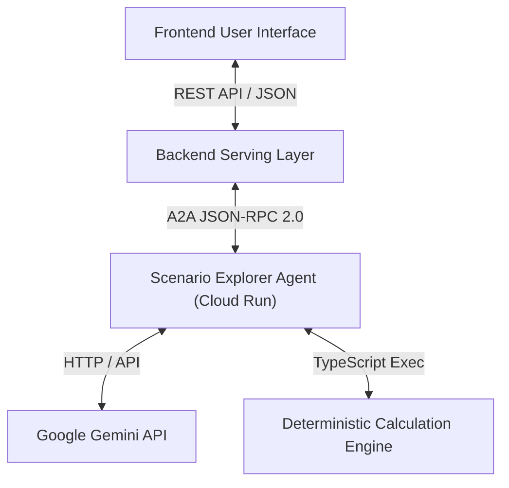
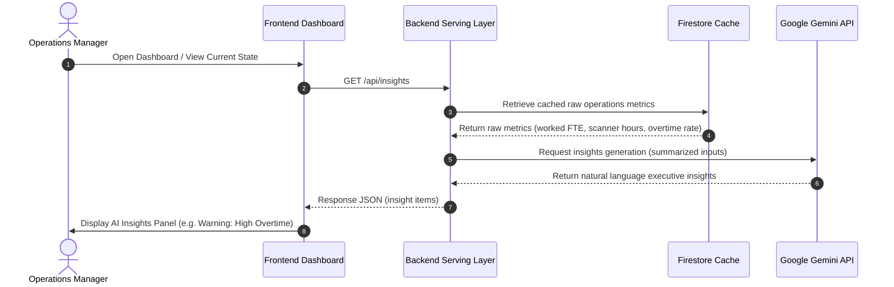
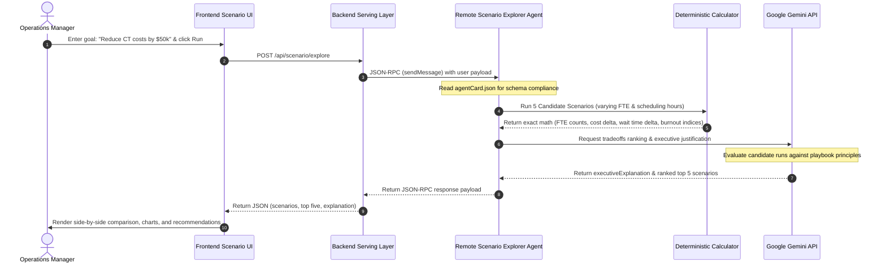
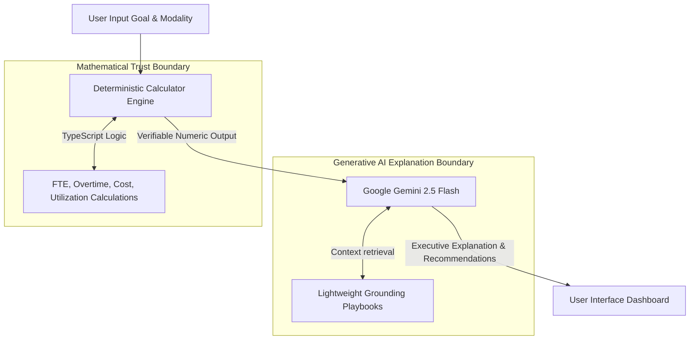
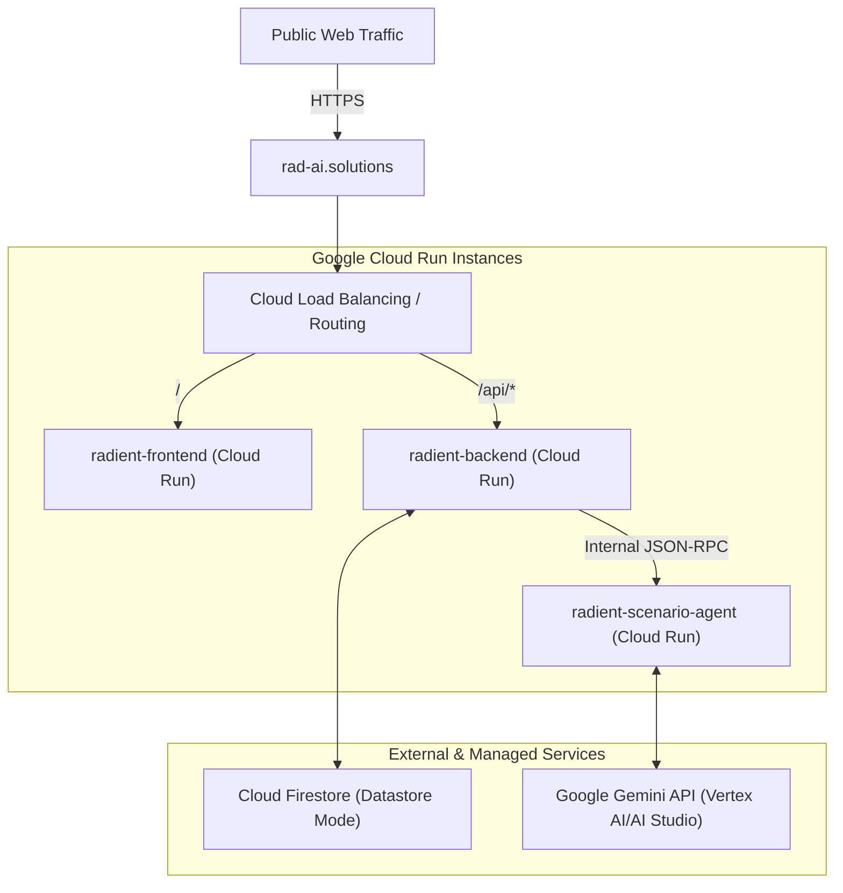

# System Architecture — Radient AI

This document provides a detailed layout of Radient AI's system architecture, operational boundaries, microservices topologies, and agent flow configurations.

---

## 1. High-Level App Architecture
The system consists of a Frontend Dashboard, a Backend Serving Layer, and an isolated remote Agent-to-Agent (A2A) Scenario Explorer Agent.



---

## 2. AI Insights Current-State Flow
The current-state AI Insights feature explains current operational metrics based on synthetic historical logs.



---

## 3. AI Scenario Explorer Future-State Flow
The Scenario Explorer suggests optimized settings for future operations based on user constraints and natural language goals.



---

## 4. Remote A2A Scenario Agent Flow
Details how the agent-to-agent protocol handles handshake, discovery, and message routing.

```mermaid
graph LR
  Client["Backend A2A Client"] -->|1. GET /.well-known/agent-card.json| Server["Remote A2A Server"]
  Server -->|2. Return Agent Card Metadata| Client
  Client -->|3. POST /a2a/jsonrpc (sendMessage)| Server
  Server -->|4. Execute Task via ScenarioExecutor| Server
  Server -->|5. Return JSON-RPC Response message| Client
```

---

## 5. Gemini + Deterministic Tools + Grounding Boundary
Demonstrates the separation of concerns. Gemini does **not** perform calculations. It only explains and synthesizes.



---

## 6. Cloud Run Service Layout
The microservice layout deployed in Google Cloud Run.



> **Note on Implementation Details:**  
> Formulas, private playbook paths, and exact network weights are kept in the private repository space. "Implementation details intentionally omitted from the public repository."
